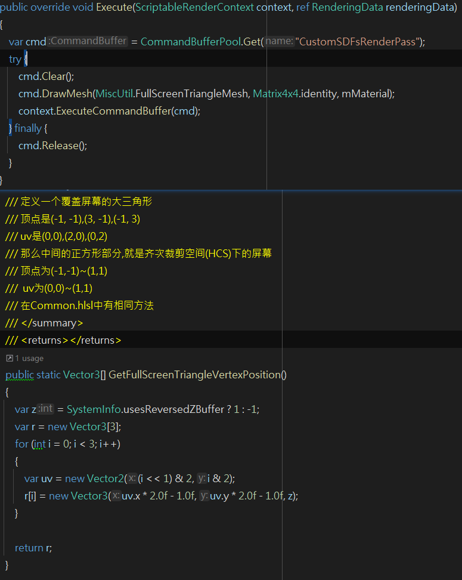

# CustomSDFsWithUnity
用Unity实现SDF绘制,学习资料来自于https://iquilezles.org/articles/distfunctions/  

#### 首先
需要定义一个覆盖屏幕的三角形，再借助URP的RenderFeature绘制到屏幕上。这样就有了一个基础的"画布"。相关代码在CustomSDFsRenderPassFeature.Pass.cs  
